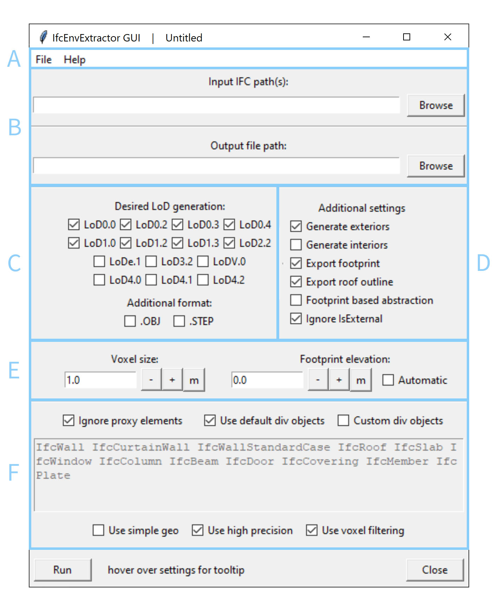
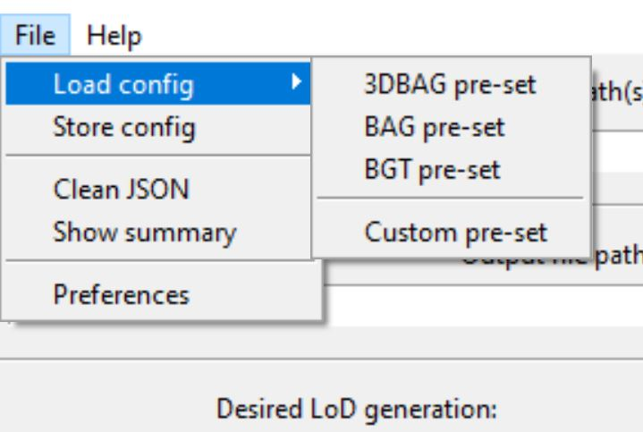
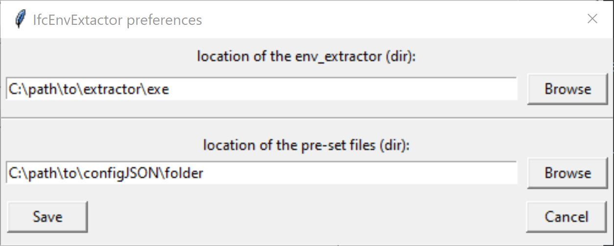
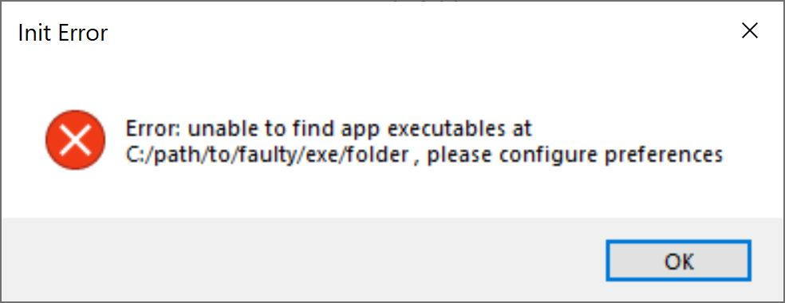
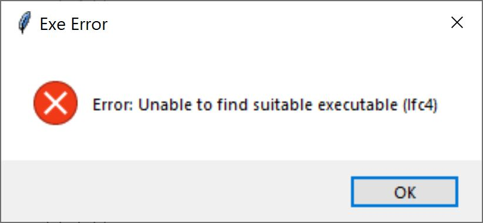
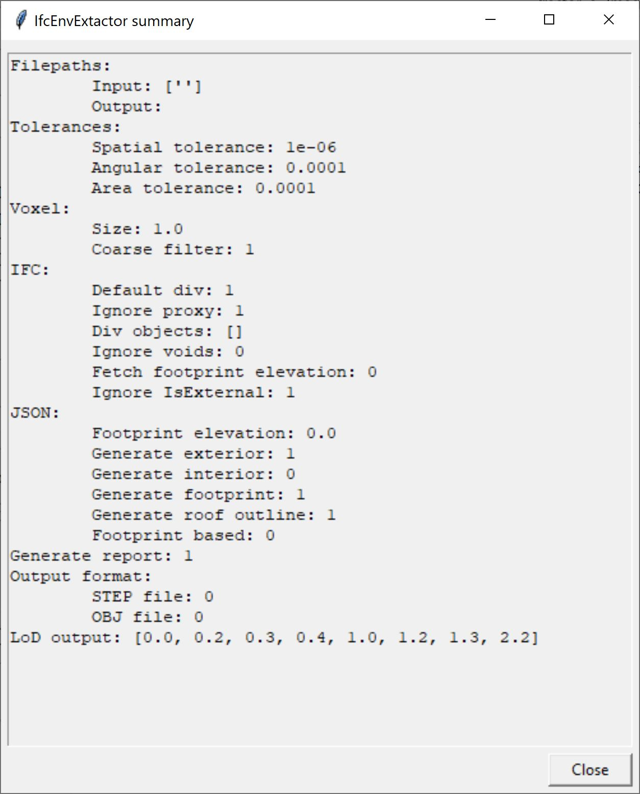
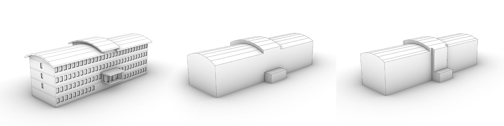
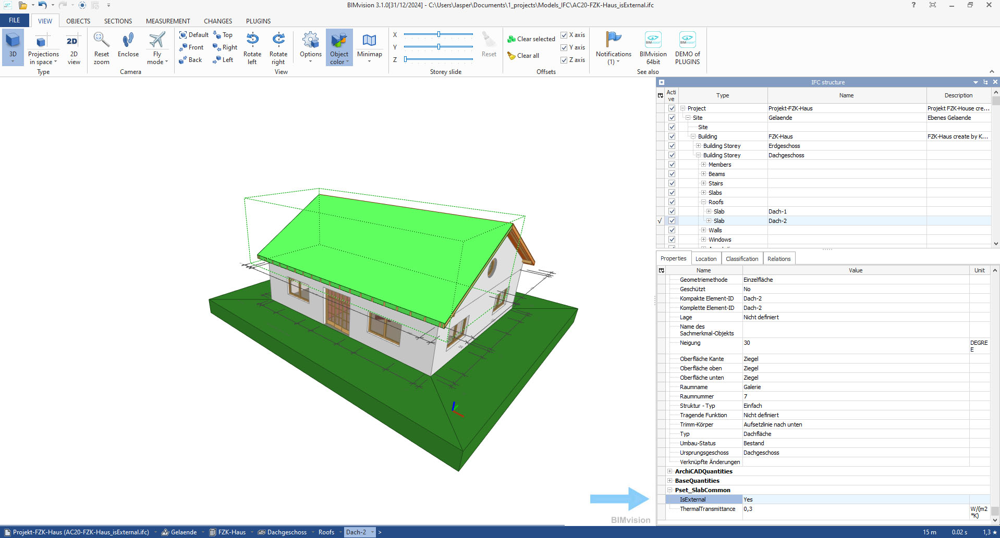
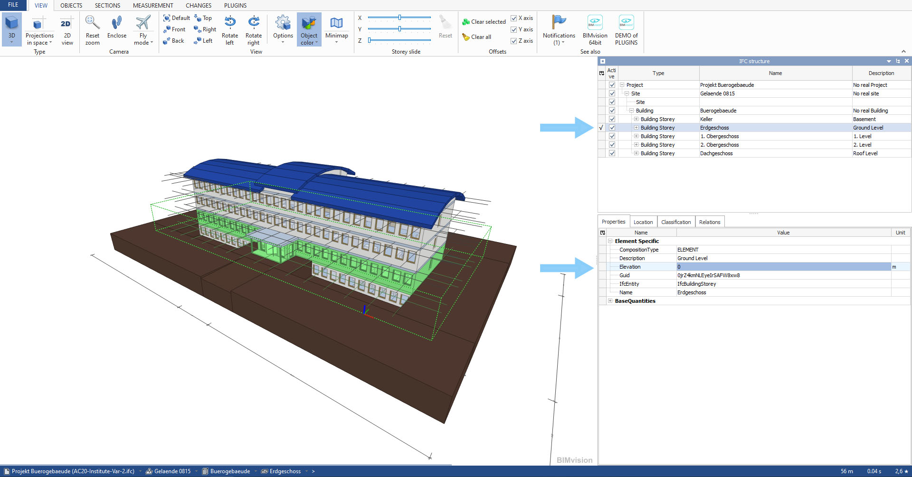

# Graphical User Interface

The Graphical User Interface (GUI) was created to allow normal people without extremely advanced knowledge to use the tool easily. However, the GUI is still a complex interface. This document will go through every part of the GUI and briefly explain how it works. The image below shows the GUI split up in groups that reflect the sections in this document. This will make it easy to hop to the settings which need explanation.

<figure align="center" width="100%">
    
    <figcaption>The GUI with different parts highlighted</figcaption>
</figure>

Note that not all settings are available in the simple version of the GUI.

## Top ribbon menu (A)

The top ribbon menu gives the user some options to process configJSON files. Additionally it also gives access to the preferences menu from which the default paths can be changed.

### Load and store configJSON files

The settings can be set in the GUI but the settings can also be loaded from a configuration JSON file. The GUI give the option to easily load pre-set configJSON files. These will be accessible in the ribbon menu via "File -> load Config". The "Load config" menu is populated with files that are stored in the *default-data* folder that is located in the same folder as the GUI. By default this folder is populated with config files that are set up to meet the requirements of geometry for the Dutch BAG, BGT and 3DBAG databases. Users can add their own config files in this folder. These will be added to the "Load Config" menu upon reopening the GUI (with a max of 10 files). Other configJSON files can be opened via "File -> Load Config -> Custom pre-set".

<figure align="center" width="100%">
    
    <figcaption>The location of the pre-set configJSON files</figcaption>
</figure>

Only a subset of the settings are available from the GUI. The complete settings collection is only available via a configuration JSON file. So, if more advanced settings are required a configuration JSON file has to be created. This can be done completely manually, but the GUI can also help. By going to “File -> Store config” the current settings set in the GUI can be saved to a configJSON file which can be used as is, or further edited with more advanced settings. For more info related to the settings see [here](../README.md/#configuration-json). This section also explains the settings that can be accessed via the GUI.

### Change the default search folders

Via "File -> Preferences" the preferences menu can be opened. From here the default folder can be changed from which "File -> Load config" menu is populated. This can be useful if there is a different folder where these pre-made config files are stored.

<figure align="center" width="100%">
    
    <figcaption>The preferences window</figcaption>
</figure>

<figure align="center" width="100%">
    
    
    <figcaption>If the GUI is unable to find the folder where the executables are stored it will throw an error on GUI startup (left) or on running the extractor (right). This can be resolved by updating the env_extractor path in the preferences menu </figcaption>
</figure>

The preferences menu also allows the user to change the location where the envelope extractor executables (.exe) files are stored. By default the GUI looks for the executables in the same folder as the GUI or a folder named *binary* that is placed in the same folder as the GUI. If the executables are placed at a non-default location and this is not specified in the preference menu the GUI will throw an error on startup and on running of the extractor.

### Working with advanced configJSON files

A loaded configJSON file can set more settings than are available in the GUI. So in the background some undesirable settings could be passed on to the extractor or to the saved configJSON files. The interface passes all settings, also the settings that cannot be changed in the GUI.

<figure align="center" width="100%">
    
    <figcaption>The summary window showing the summary of the generic starting data of the GUI</figcaption>
</figure>

"File -> Show summary" opens a windows that displays all the settings that are being set (by the GUI and the loaded config file). If there are settings present that are undesirable the "File -> Clean JSON" option can help. This option will remove all settings that are unavailable from the GUI from the memory. So it will present a completely "clean" file.

## I/O path settings (B)

The I/O path settings set the input and output paths. The input path is the path to the input IFC file(s). The tool supports multi-file model processing, so this means that different aspect models can be selected at once. It is recommended to not add all aspect models. For example, a plumbing model is usually not important for a building representation in GIS.

## Output LoD settings (C)

The LoD settings allows the user to select the LoD that is desired as output. These LoD are sorted based on their complexity. The first row only covers non-volumetric output. The second row is only 2.5D output. The third row is 3D shell and shell like output. The fourth row is non-shell like output (or 1:1 output). [More info about what every LoD means can be found here](./2_LoD.md).

Underneath the LoD output settings there is a small tab covering additional formats. These additional formats are .obj and .step. Unlike CityJSON these formats do not support multiple LoD or attributes in a similar manner. Due to this these files will not be nested. So, every LoD and every surface type group of these LoD will be placed in a different file.

## Additional settings (D)

The additional settings allow the user to fine tune the LoD output to their needs. As of V0.4 six settings are available:

* Generate Exteriors: Generate and output the outer shell of the model.
* Generate Interiors: Generate and output the inner shell of the model.
* Export footprint: Generate and output the footprint of the model.
* Export roof outline: Output the roof outline of the model.
* Footprint based abstraction: Trim the LoD1.2, 1.3, and/or 2.2 solid to comply with the footprint.
* Ignore IsExternal: do not rely on the IsExternal attribute of the IFC model but detect self what is interior or exterior. This is fairly reliable, but also slows down the processing speed. The IsExternal attribute is often not properly set in an IFC model, so it can only relied upon if the IFC models are very well made.

Based on the selected LoD some of these settings will not be available. The GUI will communicate this by disabling the toggles.

<figure align="center" width="100%">
    
    <figcaption>The difference between normal (middle) and footprint based abstraction (right) in a LoD2.2 representation based on the same input (left). </figcaption>
</figure>

<figure align="center" width="100%">
    
    <figcaption>The IsExternal attribute value of an object can be found in an IFC viewer like BIMvision. Note that if this attribute is not populated it can not only show as "No" but the whole IsExternal attribute can also be missing. This is an altered FZK Haus model of KIT where the IsExternal attribute is manually populated.</figcaption>
</figure>

## voxel and footprint settings (E)

### The voxel size

The voxel size is a complex variable. It is challenging to set this value without knowing how it is used. So this is a slightly more technical description.

Voxels are VOlumetric piXELS. So 3D versions of the pixels (the squares that make up digital images). These voxels are placed in a 3D grid to make a 3D pixelated representation of the building. The LoD5.0 output creates a shell structure out of these voxels, which can be interesting to see how it looks.

These voxels are used for a variety of processes:

* Coarse filtering the roofing structure.
* Coarse filtering the objects that play a role in the outer shell.
* Ray-casting sources and targets.
* Approximation of interior volumes.
* Elimination of inner loops in the footprint creation.
* Detection if surface is internal or external in the LoD0.3 storeys.
* and more

As long as no very large (+2 meter) or extremely small (-0.005 meter) size voxels are chosen the general rule is: the smaller the voxels, the more accurate the results. However, also the smaller the voxels, the slower the process becomes. If extremely small voxels are chosen however it can also cause issues with the accuracy. In general for most middle-sized models a voxel size of between 0.1 and 0.5 meter would suffice.

### Footprint elevation

The footprint elevation is the elevation of the ground floor in the IFC model. This is not the height it has in real life, but the height in the IFC model itself. You can find this height in the attributes of an IfcStorey object. Usually this elevation is 0m, but it can be different.

<figure align="center" width="100%">
    
    <figcaption>The elevation value of a storey can be found in an IFC viewer like BIMvision</figcaption>
</figure>

Automatic detection can be checked. If this is done the tool will try to find the footprint elevation itself. It will do so based on the rules set by the [BIM base IDS](https://www.digigo.nu/en/ilsen-en-richtlijnen/bim-base-ids/3-3-construction-level-arrangement-and-naming/) ([BIM basis ILS](https://www.digigo.nu/ilsen-en-richtlijnen/bim-basis-ils/3-3-bouwlaagindeling-en-naamgeving/)) of DIGIGO. In summary, the tool will search for a IfcStorey object that starts with "00" and use its "Elevation" attribute value. If it is unable to find a suitable storey the application will terminate.

## Input object related settings (F)

The input object related settings mostly covers which and how IFC objects of the input file(s) are to be used. 

The top row of settings and the text window cover which objects are to be used. By default the tool uses 12 different IfcClasses: IfcWall IfcCurtainWall IfcWallStandardCase IfcRoof IfcSlab IfcWindow IfcColumn IfcBeam IfcDoor IfcCovering IfcMember IfcPlate. The rest of the objects in the IFC model are not used by the tool, these are completely ignored. For most cases these 12 classes suffice. If not, the toggles allow them to be changed. The "Custom div objects" enables the text window so that types can be typed. This is not cases sensitive, but it does require valid IfcClasses. [A complete list of these classes can be found here](https://ifc43-docs.standards.buildingsmart.org/IFC/RELEASE/IFC4x3/HTML/annex-b.html).

The lower row of settings specifies how these objects are to be used:

* Use simple geo: Some IFC models are modeled with void objects to create holes in other objects. If the simple geo option is toggled the tool does not apply these voids. This will improve the speed and reliability, at the cost of losing openings.
* Use high precision: by default the tool uses a precision of slightly smaller than the width of a human hair. This can be lowered to a 1/10th of a millimeter by toggling this off. But usually that will cause other issues.
* Use voxel filtering. [As described earlier](#the-voxel-size) voxels play a central role in coarse filtering. Some building shapes do not lend themselves very well to being coarse filtered using voxels however. To avoid issues with this the "Use voxel filtering" can be turned off. This will make the process more accurate, but will also slow the process down.