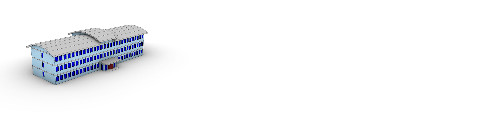
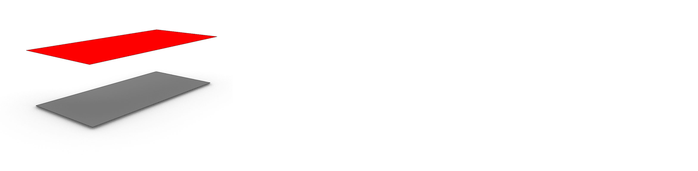
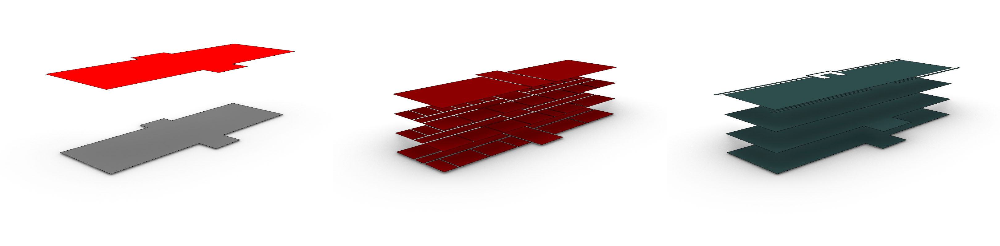
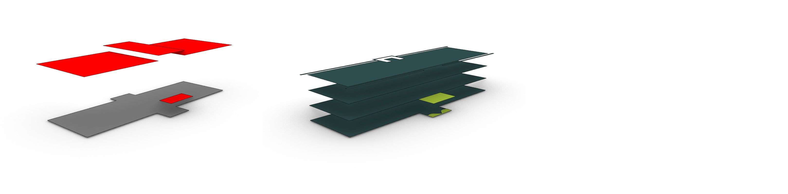
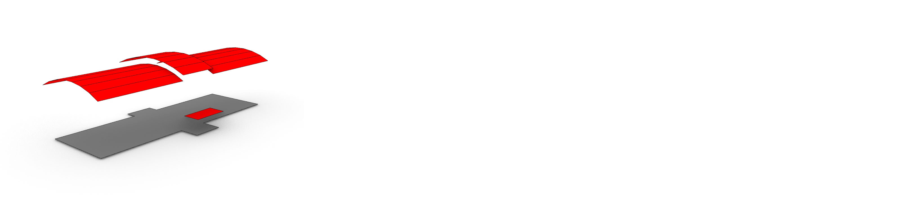
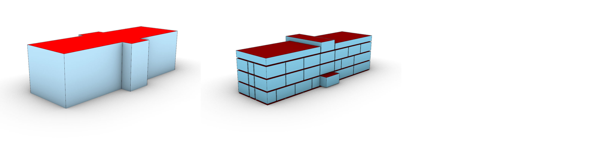
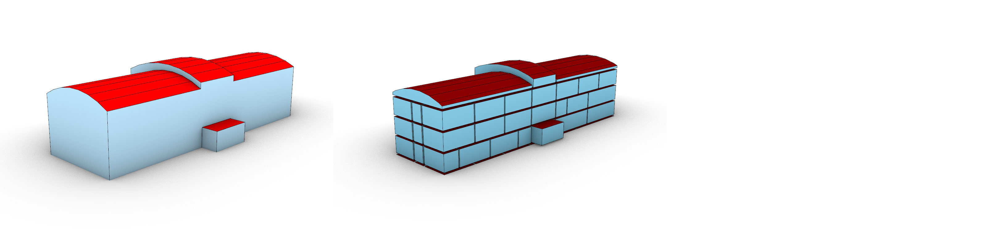
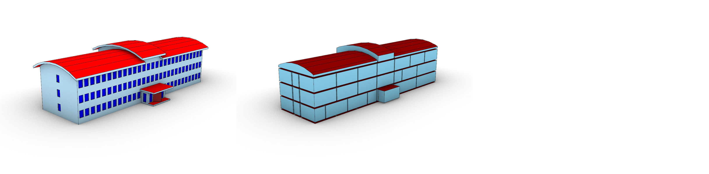
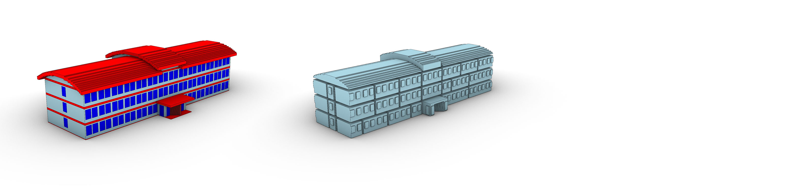
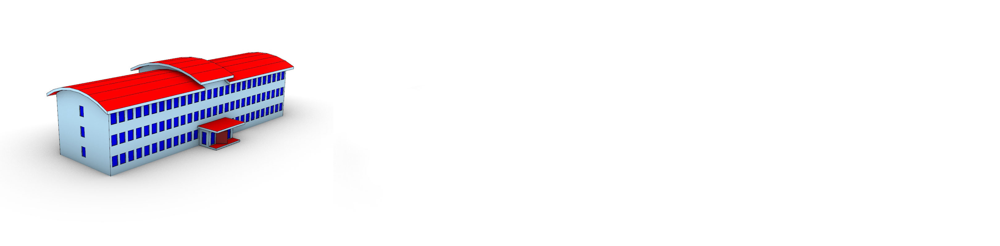

<!-- markdownlint-disable MD033 -->
<!-- markdownlint-disable MD034 -->

# Output LoD

The envelope extractor has a large set of possible LoD output that builds on the framework developed by the TU Delft [(Biljecki et al., 2016)](#2). This document covers the most useful different LoD that the tool outputs. LoDb, c, and d are not covered because the related processes were only added for research purposes. These algorithms are not robust nor well optimized. [More info about this research and these LoD can be found here](https://research.tudelft.nl/en/publications/defining-lods-to-support-bim-based-3d-building-abstractions-in-gi/). The only "research" LoD abstractions that are covered here are LoD0.4 (LoDa), LoDe.1, and LoD5.0 (LoDV). These were, as of v0.4, the only "research" LoD that continued development past an initial research/experimental state.

The examples show output that is based on the Institute model created by KIT.

    

           
    

    

        <em>The input model that is used for the LoD examples</em>
    

The tool does some pre-filtering, type isolation and complex shape simplifications regardless of the output LoD. These processes are utilized for the output of each LoD unless it is clearly specified in the description. More information about these processes can be found in the technical report of the tool.

## LoD0

LoD0 is an officially supported LoD. It is described by the [CityGML3.0 standard](https://docs.ogc.org/is/20-010/20-010.html) as a "Highly generalized model". LoD0 is split further in 4 sub-levels. LoD0.0, 0.2, and 0.3 loosely follow the framework developed by the TU Delft [(Biljecki et al., 2016)](#2). LoD0.4 is a newly introduced LoD that does not fit any general framework at this time.

### LoD0.0

A 2D bounding surface representation of the input BIM model in the XY plane.

    

      
    

    

        <em>Example of LoD0.0</em>
    

The representation consists out of:

* Roof surface:
  * The roof surface is the top surface of the smallest oriented bounding box surrounding the complete model. This is placed at the top height of the bounding box if footprint extraction is desired. If footprint extraction is not desired it is placed at the ground surface elevation height.
  * $n = 1$
  * Type: *RoofSurface* or *+ProjectedRoofOutline* if no footprint extraction is selected.
* Footprint surface:
  * The footprint surface is the top surface of the smallest oriented bounding box surrounding all the objects that are placed at $+-0.5$ meter of the ground elevation height. This surface is placed at the ground surface elevation height.
  * $n = 1$
  * Type: *GroundSurface*

### LoD0.2

    

      
    

    

        <em>Example of LoD0.2. Left: the external roof and ground surfaces. Middle: the internal spaces. Right: the internal storeys.</em>
    

Simple 2.5D 2D surface representation of the input BIM model where every surface has a normal direction of $(0,0,1)$. The model is 2.5D between surfaces created from the same "source" (such as the roof surfaces). Overhang is allowed between surfaces that are based on different "sources" even if they have the same surface type (such as different storey representations).

The representation consists out of:

* Roof surface:
  * A roof surface is created by projecting all the roof surfaces to the XY plane. The surfaces that are touching or overlapping are merged together. These merged surfaces are placed at the top height of the BIM model if footprint extraction is desired. These merged surfaces are placed at the ground surface elevation height when is not desired.
  * $n \geq  1$
  * Type: *RoofSurface* or *+ProjectedRoofOutline* if no footprint extraction is selected.
* Footprint surface:
  * A footprint surface is created by making a horizontal section through the entire BIM model at the footprint elevation height. Horizontal surfaces that lie within $+-0.15$ meter of the footprint elevation height are also included. The resulting surfaces are merged together and internal loops that represent internal building structures (such as plumbing/ventilation shafts) are eliminated. Internal loops that represent external building structures, such as courtyards remain. This representation is identical to the LoD0.3 and 0.4 footprint.
  * $n \geq  1$
  * Type: *GroundSurface*.
* Space surface:
  * A space surface is created, per space, by taking the IfcSpace object's top surfaces and projecting it to the XY plane at the space's lowest height. These surfaces are merged to create a single surface per space.
  * $n \geq  1$ if the model includes IfcSpace objects, if not $n =  0$
  * Type: *+ProjectedCeilingOutline*.
* Storey surface:
  * A storey surface is created by making a horizontal section through the entire BIM model at the storey's elevation height. Horizontal surfaces that lie within $+-0.15$ meter of this height are also included. The resulting surfaces are merged together.
  * $n \geq  1$ if the model includes IfcStorey objects, if not $n =  0$
  * Type: *FloorSurface*.

### LoD0.3

    

      
    

    

        <em>Example of LoD0.3. Left: the external roof and ground surfaces. Middle: the internal storeys.</em>
    

2.5D 2D surface representation of the input BIM model where every surface has a normal direction of $(0,0,1)$. The model is 2.5D between surfaces created from the same "source" (such as the roof surfaces). Overhang is allowed between surfaces that are based on different "sources" even if they have the same surface type (such as different storey representations).

The representation consists out of:

* Roof surface:
  * A roof surface that is created by grouping and flattening the roof structure of the input BIM model. This is done by first grouping the roof surfaces that touch each other (either intersect or share edges). The surfaces are, per group, projected to the XY plane at the top height of the group. The surfaces are, per group, merged into a single surface. Overlap between each group is eliminated by trimming the surfaces that lie below another in the XY plane.
  * $n \geq  1$
  * Type: *RoofSurface*.
* Footprint surface:
  * A footprint surface is created by making a horizontal section through the entire BIM model at the footprint elevation height. Horizontal surfaces that lie within $+-0.15$ meter of the footprint elevation height are also included. The resulting surfaces are merged together and internal loops that represent internal building structures (such as plumbing/ventilation shafts) are eliminated. Internal loops that represent external building structures, such as courtyards remain. This representation is identical to the LoD0.2 and 0.4 footprint.
  * $n \geq  1$
  * Type: *GroundSurface*.
* Storey surface:
  * A storey surface is created by making a section through the IfcStorey object's related object at the storey's elevation height. Horizontal surfaces that lie within $+-0.15$ meter of this height are also included. For each of the surfaces it is evaluated if they lie they represent internal or external surfaces. Per group these surfaces are merged together.
  * $n \geq  1$ if the model includes IfcStorey objects, if not $n =  0$
  * Type: *FloorSurface* or *OuterFloorSurface*.

### LoD0.4

    

      
    

    

        <em>Example of LoD0.4.</em>
    

2.5D surface representation where every surface has the same normal as it's source shape. The model is 2.5D between surfaces created from the same "source" (such as the roof surfaces). Overhang is allowed between surfaces that are based on different "sources".

The representation consists out of:

* Roof surface:
  * A roof surface that is created by grouping the roof structure of the input BIM model. This is done by first grouping the roof surfaces that touch each other (either intersect or share edges). Overlap between each group is eliminated by trimming the surfaces that lie below another in the XY plane.
  * $n \geq  1$
  * Type: *RoofSurface*.
* Footprint surface:
  * A footprint surface is created by making a horizontal section through the entire BIM model at the footprint elevation height. Horizontal surfaces that lie within $+-0.15$ meter of the footprint elevation height are also included. The resulting surfaces are merged together and internal loops that represent internal building structures (such as plumbing/ventilation shafts) are eliminated. Internal loops that represent external building structures, such as courtyards remain. This representation is identical to the LoD0.2 and 0.3 footprint.
  * $n \geq  1$
  * Type: *GroundSurface*.

## LoD1

LoD1 is an officially supported LoD. It is described by the [CityGML3.0 standard](https://docs.ogc.org/is/20-010/20-010.html) as a "Block model / extrusion objects".

### LoD1.0

    

      
    

    

        <em>Example of LoD1.0.</em>
    

3D bounding box representation of the input BIM model.

The representation consists out of:

* Outer shell:
  * The smallest oriented bounding box surrounding the complete BIM model.
  * $n =  1$
  * Type: *RoofSurface*, *GroundSurface*, and *WallSurface*.

### LoD1.2

    

      
    

    

        <em>Example of LoD1.2. Left: outer shell. Middle: inner shell.</em>
    

2.5D volumetric representation of the input BIM model with uniform flat top and bottom surfaces.

The representation consists out of:

* Outer shell:
  * Volume can be created in two different ways depending on the settings:
    * The LoD0.2 roof surface can be extruded downwards to the ground level elevation.
    * The LoD0.2 ground surface can be extruded upwards to the top building height.
  * $n \geq  1$
  * Type: *RoofSurface*, *GroundSurface*, and *WallSurface*.
* Inner shell:
  * Volume that is created, per space, by extruding the LoD0.2 *+ProjectedCeilingOutline* surfaces upwards to the space's top height.
  * $n \geq  1$ if the model includes IfcSpace objects, if not $n =  0$
  * Type: *CeilingSurface*, *FloorSurface*, and *InteriorWallSurface*.

### LoD1.3

    

      
    

    

        <em>Example of LoD1.3.</em>
    

2.5D volumetric representation of the input BIM model with flat top and bottom surfaces. Every surface has a normal Z-component that is either 1 or 0.

The representation consists out of:

* Outer shell:
  * Volume that is created by extruding the LoD0.3 surfaces to the ground surface elevation height. The resulting solids are merged into one if they share surfaces. Depending on the settings this solid is trimmed to comply with the footprint dimension.
  * $n \geq  1$
  * Type: *RoofSurface*, *GroundSurface*, and *WallSurface*.

## LoD2

LoD2 is an officially supported LoD. It is described by the [CityGML3.0 standard](https://docs.ogc.org/is/20-010/20-010.html) as a "Realistic, but still generalized model".

### LoD2.2

    

      
    

    

        <em>Example of LoD2.2. Left: outer shell. Middle: inner shell.</em>
    

2.5D volumetric representation of the Input BIM model.

The representation consists out of:

* Outer shell:
  * Volume that is created by extruding the LoD0.4 surfaces to the ground surface elevation height. The resulting solids are merged into one if they share surfaces. Depending on the settings this solid is trimmed to comply with the footprint dimension.
  * $n \geq  1$
  * Type: *RoofSurface*, *GroundSurface*, and *WallSurface*.
* Inner shell:
  * Volume that is created, per space, by extruding the IfcSpace's roof surface to the IfcSpace's minimal floor height.
  * $n \geq  1$ if the model includes IfcSpace objects, if not $n =  0$
  * Type: *CeilingSurface*, *FloorSurface*, and *InteriorWallSurface*.

## LoD3

LoD3 is an officially supported LoD. It is described by the [CityGML3.0 standard](https://docs.ogc.org/is/20-010/20-010.html) as a "Highly detailed model". The output of the tool deviates here from the GML3.0 standard by only classifying shell models LoD3. CityGML3.0 also allows non-shell models to be LoD3. The tool classifies those models as LoD4.

### LoD3.2

    

      
    

    

        <em>Example of LoD3.2. Left: outer shell. Middle: inner shell.</em>
    

3D volumetric representation of the input BIM model.

The representation consists out of:

* Outer shell:
  * Volume that is created by isolating the (partially) external surfaces utilizing a ray-casting process. These resulting surfaces are trimmed with each other. The resulting surfaces that are external are merged together based on their preceived surface type.
  * $n \geq  1$
  * Type: *RoofSurface*, *GroundSurface*, *WallSurface*, *window*, and *door*.

## LoD4

LoD4 is not an officially supported LoD. LoD4 was described by the CityGML2.0 standard. But this LoD was dropped on the introduction of the CityGML3.0 standard. LoD4 is used here for output which is not converted to a shell, often called 1:1 conversion. This output would fit in the current CityGML3.0 LoD3. To keep clear what is a shell model and what is not a shell model the choice was made to make all "Highly detailed" shell models LoD3 and the "Highly detailed" complex models LoD4.

### LoD4.0

    

      
    

    

        <em>Example of LoD4.0.</em>
    

3D complex representation (not a shell) of all the objects that are part of the external facade of the BIM model. LoD4.0 can also be seen as the first step in the creation of LoD3.2 where all the external objects are isolated.

The representation consists out of:

* Complex:
  * A group of volumes that can be collected in two different ways depending on the settings:
    * The volumes can be collected by selecting the IfcObjects that have the attribute *IsExternal* set to true.
    * The volumes can be collected by isolating the objects that are external according to a ray casting process.
  * $n \geq  1$
  * Type: every IfcType preceded by a +. For example: *+IfcWall*.

### LoD4.1

    

      
    

    

        <em>Example of LoD4.1.</em>
    

3D complex representation (not a shell) of all the selected space dividing objects.

The representation consists out of:

* Complex:
  * A group of volumes that is collected by taking the space dividing objects and converting them as close to 1:1 as possible.
  * $n \geq  1$
  * Type: every IfcType preceded by a +. For example: *+IfcWall*.

### LoD 4.2

    

      
    

    

        <em>Example of LoD4.2.</em>
    

3D complex representation (not a shell) of the input model. This is unfiltered and unabstracted, completely bypassing the geometric optimization of the tool. The closest possible to a 1:1 conversion.

The representation consists out of:

* Complex:
  * A group of volumes that is collected by taking the BIM objects and converting them as close to 1:1 as possible.
  * $n \geq  1$
  * Type: every IfcType preceded by a +. For example: *+IfcWall*.

## LoD5/experimental LoD

These LoD models are not officially supported LoD. The were used for scientific research or are considered of use in practice but have not been standardized.

### LoD5.0/V

    

      
    

    

        <em>Example of LoD5.0. Left: outer shell. Middle: inner shell.</em>
    

3D voxel representation of the input model.

The representation consists out of:

* Outer shell:
  * Volume that is created by isolating the external outer surfaces of the intersecting voxels. These surfaces can be given a type based on their intersection data. Surfaces that share the same type are merged.
  * $n \geq  1$
  * Type: every IfcType preceeded by a +. For example: Type: *RoofSurface*, *GroundSurface*, *WallSurface*, *window*, and *door*.
* Inner shell:
  * Volumes that are created by isolating the internal outer surfaces of the intersecting voxels. These surfaces can be given a type based on their intersection data. Surfaces that share the same type and space are merged.
  * $n \geq  1$
  * Type: no types have been implemented as of yet.

### LoDe.1

    

      
    

    

        <em>Example of LoDe.1.</em>
    

3D polygon representation of the input model. This can be seen as the second step of the LoD3.2 creation. LoD4.0 can be seen as step one.

The representation consists out of:

* Outer polygons:

  * collection of surfaces that is created by taking the LoD4.0 objects and isolating the outer surfaces with the help of a ray-casting process.
  * $n \geq  1$
  * Type: *RoofSurface*, *GroundSurface*, *WallSurface*, *window*, and *door*.

## References

Biljecki, F., Ledoux, H., & Stoter, J. (2016). An improved LOD specification for 3D building models. Computers, environment and urban systems, 59, 25-37.
